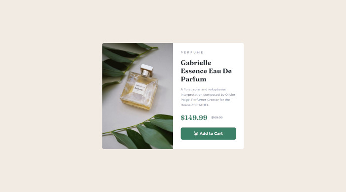

# Frontend Mentor - Product preview card component solution

This is a solution to the [Product preview card component challenge on Frontend Mentor](https://www.frontendmentor.io/challenges/product-preview-card-component-GO7UmttRfa). Frontend Mentor challenges help you improve your coding skills by building realistic projects.

## Table of contents

- [Overview](#overview)
  - [The challenge](#the-challenge)
  - [Screenshot](#screenshot)
  - [Links](#links)
- [My process](#my-process)
  - [Built with](#built-with)
  - [Useful resources](#useful-resources)
- [Author](#author)
- [Acknowledgments](#acknowledgments)

**Note: Delete this note and update the table of contents based on what sections you keep.**

## Overview

### The challenge

Users should be able to:

- View the optimal layout depending on their device's screen size
- See hover and focus states for interactive elements

### Screenshot

### Links

- Solution URL: [Solution](https://github.com/unkovicgit/product-preview-card-component)
- Live Site URL: [Live Site](https://unkovicgit.github.io/product-preview-card-component/)

## My process

### Built with

- Semantic HTML5 markup
- SASS
- Flexbox
- CSS Grid
- Mobile-first workflow
- TypeScript

### Useful resources

- [CSS-Tricks](https://css-tricks.com/)
- [MDN Web Docs](https://developer.mozilla.org/en-US/)
- [SASS Docs](https://sass-lang.com/documentation/)

## Author

- Website - [Unković Nemanja](https://github.com/unkovicgit/)
- Frontend Mentor - [@unkovicgit](https://www.frontendmentor.io/profile/unkovicgit)
- Twitter - [@nemanja_unkovic](https://twitter.com/nemanja_unkovic)
